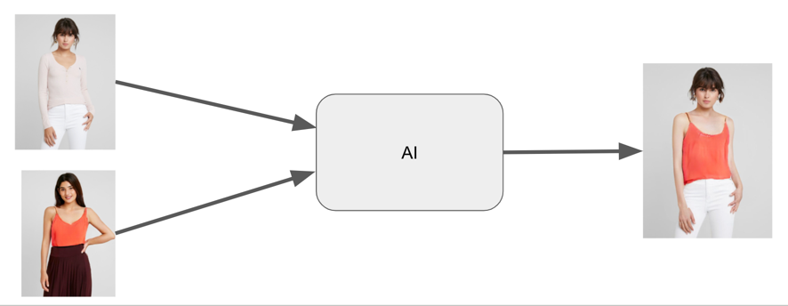
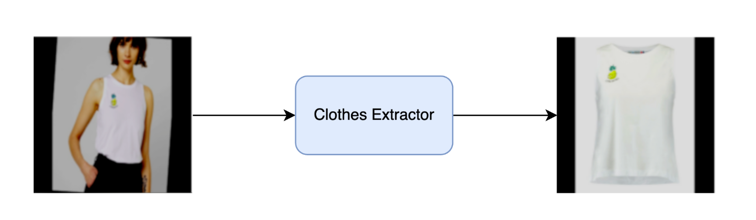
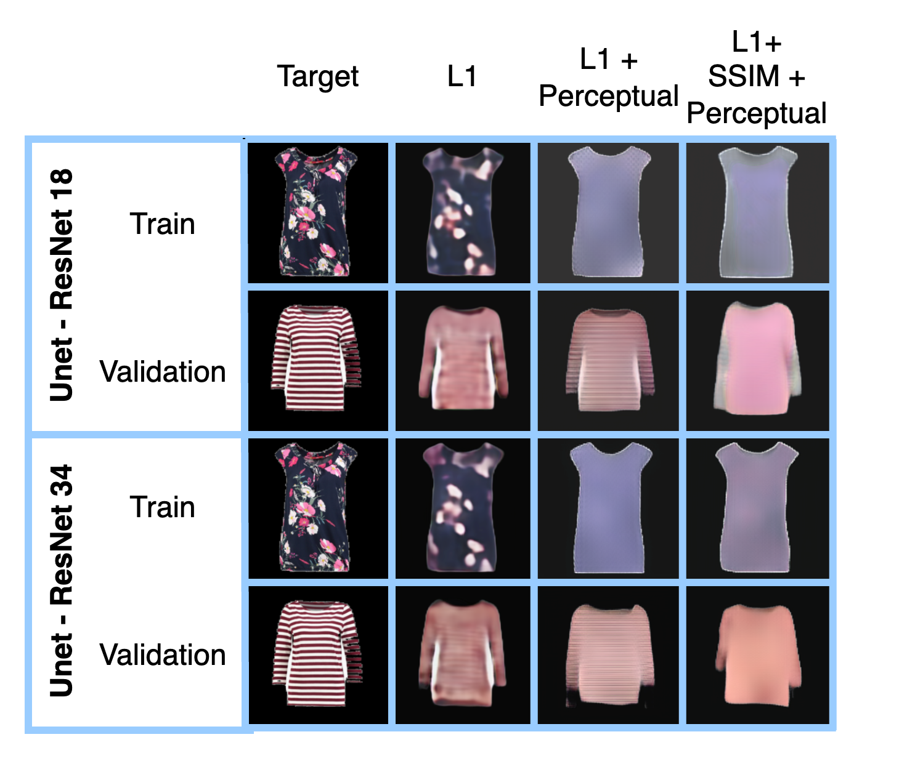
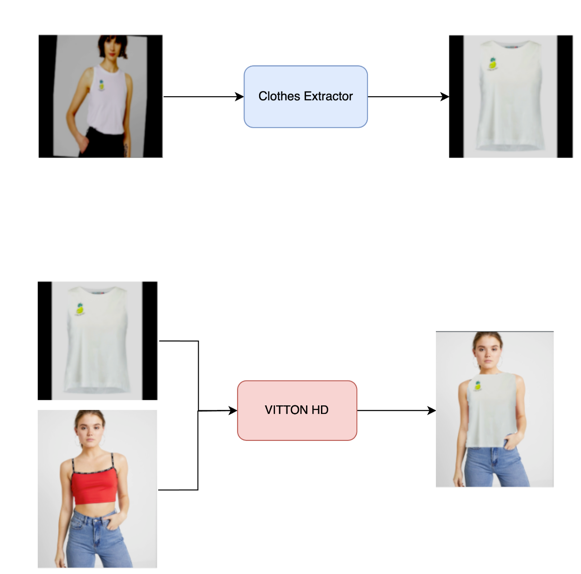

# clothes-extractor
2024 Postgraduate course on Artificial Intelligence with Deep Learning, **UPC School**.

Authored by **Josep Maria Salvia Hornos, Álvaro Cabanas Martí, Joan Puig Sanz and Raúl Alares**.

Advised by **Pol Caselles**.

---

Table of Contents
=================
  * [INTRODUCTION](#introduction)
  * [DATASET](#dataset)
  * [PROJECT ARCHITECTURE](#project-architecture)
	 * [INITIAL APPROACH](#initial-approach)

## Motivation
We want to allow users to try virtually the clothes before buying them online.
This could help users to make better decisions and save returning costs.



## Our proposal
We did not have enough resources to implement the whole pipeline during given time, so we modified the initial proposal to a more feasible one.

In this project we have trained a model using a patch-GAN to extract the t-shirt from an image of a person and generate a frontal img of the t-shirt.

On inference the model expects an input image and a segmented mask from the image. We have left the segmenter model that would extract the mask for future development.



## Dataset
We use the dataset from the [VITON-HD project](https://github.com/shadow2496/VITON-HD).
In order to run the code you need to download and unzip the [VITON-HD dataset](https://github.com/shadow2496/VITON-HD?tab=readme-ov-file#dataset) in the `data` folder.

Viton-HD Dataset is divided in two parts: train and test. 

* Test is not used during project phase and it is reserved to final conclussions. 
* Train is divided in two parts (90% / 10%) used for pure training and for validation. All the training information and graphics in this document is related to this subset.

## Loss functions
There are 3 loss functions that we found relevant for our model:
* L1 loss
* Perceptual loss
* SSIM loss [SSIM](https://ieeexplore.ieee.org/document/1284395)

## Using a UNET model
Our first approach was to use a UNET model with the following common configurations:

* 200 epochs
* Learning rate of 0.0003
* Batch size 32
* Image size 224x224
* Resnet encoder with the initial imagenet weights 
* SCE attention block

We run different runs:

* Resnet 18 with L1 loss
* Resnet 18 with L1 loss + perceptual loss
* Resnet 18 with L1 loss + perceptual loss + SSIM loss
* Resnet 34 with L1 loss
* Resnet 34 with L1 loss + perceptual loss
* Resnet 34 with L1 loss + perceptual loss + SSIM loss

The following graph shows the results of the different runs:

TODO: Add graph

The following images shows the predicted results compared with the target images:



TODO: Describe the differences between the resnet18/34 and the different loss functions combinations 

We can observe that the model was capable of predicting a satisfactory shapes and colors, but it failed to predict the high frequency details of the t-shirt.

The problem with the high frequency details was expected as the UNets are well known for their poor performance in high frequency details. This is why we decided to change the model to a patch-GAN.

## Using a Patch-GAN model
We have used the following configuration for the patch-GAN model:

* 200 epochs
* Learning rate for the discriminator ????
* Learning rate for the generator ????
* Batch size 32
* Image size 224x224
* TODO: Add the rest of the configuration

## Project architecture
### Initial approach
We wanted to iterate and not start  by steps so we

[UNET](https://arxiv.org/abs/1505.04597)
[segmentation_models.pytorch](https://github.com/qubvel/segmentation_models.pytorch)

### Final architecture: PATCH-GAN (UNET Generator + Discriminator)
[]https://arxiv.org/pdf/1611.07004v3.pdf


## Development
### Low res dataset
For development purposes there is the possibility to downsize the dataset to a given size and reduce the number of images.

The viton dataset should be downloaded and unzipped in the `data` folder.

Running the following command, we will create a folder `zalando-low-res` with our downsized images.
The flag `-f` will set the number of files (or empty for all) and the flag `-s` the size: 

```bash
$ python dataset/down_sample_dataset.py -f 20 -s 64
```


## Future pipeline
For this workflow we are defining 2 pipelines:

First pipeline:

A Segmenter generates and img mask for the different clothes in the source img.
An img2img model based on a patch-GAN (U-Net for the generator) uses the image mask and the source to generate a frontal img of the extracted t-shirt.

Second pipeline:
Use the VITTON HD model to infer our generated T-shirt picture and the destiny.

