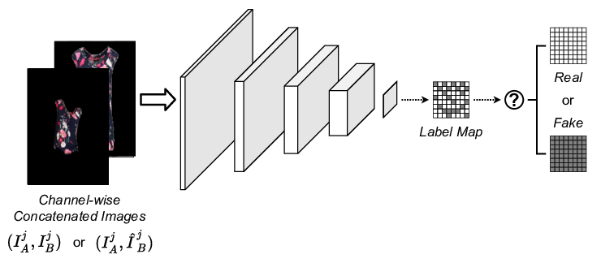
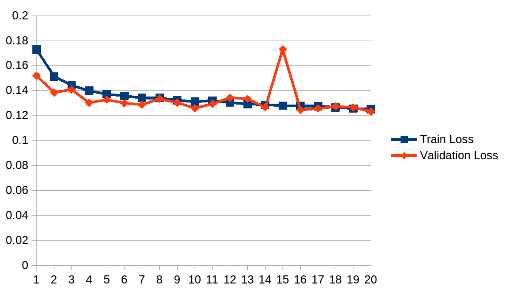

Table of Contents
=================
  * [Motivation](#motivation)
  * [Our Proposal](#our-proposal)
  * [Dataset](#dataset)
    * [Data Augmentation](#data-augmentation)
  * [Method & Architecture](#method-architecture)
    * [Resnet](#resnet)
    * [scSE Attention Block](#scse-attention-block)
    * [PatchGAN Discriminator](#patchgan-discriminator)
    * [2 Stage Architecture](#2-stage-architecture)
    * [Other Tests](#other-tests)
    * [Implementation Details](#implementation-details)
  * [Experiments](#experiments)
    * [Initial UNET Results](#initial-unet-results)
    * [UNET with 5 Levels & Attention SCSE](#unet-with-5-levels-attention-scse)
    * [L1 Loss Function](#l1-loss-function)
    * [Perceptual Loss Function](#perceptual-loss-function)
    * [SSIM Loss Function](#ssim-loss-function)
    * [Training Graphs](#training-graphs)
    * [Resnet18 and Resnet34](#resnet18-and-resnet34)
    * [Discriminator PatchGAN](#discriminator-patchgan)
    * [1 Stage Training Results](#1-stage-training-results)
    * [2 Stage Results](#2-stage-results)
  * [Development Infrastructure](#development-infrastructure)
    * [Train Infrastructure](#train-infrastructure)
    * [Experiment Tracking](#experiment-tracking)
  * [Future Work](#future-work)
    * [Improvements](#improvements)
    * [Roadmap](#roadmap)

# Motivation

We want to allow users to try virtually the clothes before buying them
online.

This could help users to make better decisions and save returning
costs.

# Our proposal

We did not have enough resources to implement the whole pipeline during
given time, so we modified the initial proposal to a more feasible one.

In this project we explored how to extract the t-shirt from an image of
a person and generate a frontal image of the t-shirt.

On inference the model expects an input image and a segmented mask from
the image. We have left the segmenter model that would extract the mask
for future development.

# Dataset

We use the dataset from the [VITON-HD
project]([[https://github.com/shadow2496/VITON-HD]{.underline}](https://github.com/shadow2496/VITON-HD))
with Zalando images that is distributed under CC-NonComercial, see
[LICENSE](https://github.com/shadow2496/VITON-HD/blob/main/LICENSE).

In order to run the code you need to download and unzip the [VITON-HD
dataset](https://github.com/shadow2496/VITON-HD?tab=readme-ov-file#dataset)
in the `data` folder.

Viton-HD Dataset is divided in two parts: train and test.

-   Test is not used during the project phase and it is reserved for
    > final conclusions.

-   Train is divided in two parts (90% / 10%) used for pure training and
    > for validation. All the training information and graphics in this
    > document is related to these subsets.

## Data Augmentation

In our project, we increase our dataset with a few clever tweaks to each
image. We have support to randomly adjust the colors to simulate
different lighting conditions and appearances; spin the image a random
angle, which helps the model to recognize objects no matter how they\'re
oriented; flip images horizontally at random, allowing our model to
learn from a mirror view without needing extra data; and we also support
zooming in on random parts of the image, which trains our model to
identify features regardless of their size or position in the frame.
These tricks give us a lot more variety in our training data, helping
our system to be more robust and accurate.

# Method & Architecture

## UNet

Our first approach was to use a small UNET model with the following
configuration with an input image of 28x28:

[TODO: Small unet]{.mark}

After some runs we decided to use the [Segmentation Models
library](https://smp.readthedocs.io/en/latest/index.html) which allowed
us to speed up the development and choose from a variety of encoders and
pretrained weights. We choose `resnet18` with 11M of parameters and
`resnet34` with 21M of parameters combined with the pretrained weight
of an imagenet and SCSE as attention. The used input image was 224x224.
To work with resnet we require to input image size multiple of 32

### Resnet

[ResNet]([[https://arxiv.org/pdf/1512.03385.pdf]{.underline}](https://arxiv.org/pdf/1512.03385.pdf))
is a type of convolutional neural network (CNN) designed to deal with
the problem of vanishing gradients, which can occur when training very
deep neural networks.

The key innovation in ResNet is the introduction of "residual blocks".
In a traditional deep learning model, each layer learns a new
representation of the data. However, in a ResNet, each layer learns a
"residual function" - a kind of modification to the identity of the
previous layer. This is achieved by adding a "shortcut connection" that
skips one or more layers, as shown below:

### scSE attention block

The spatial and channel squeeze-and-excitation (scSE) attention
mechanism enhances important areas and details in images for tasks like
image segmentation. It works by analyzing the entire image and
individual pixels simultaneously, using two separate modules that focus
on different aspects: one for the overall image context (channel) and
one for the pixel-level details (spatial). These modules then combine
their findings, using a method like taking the maximum or summing
values, to produce a feature map that highlights the most important
parts of the image. This technique helps neural networks perform better
in tasks that require understanding the image as a whole and its finer
details, all with minimal extra computational cost.

## PatchGAN Discriminator

[[Image source pre
modification](https://www.researchgate.net/figure/Architecture-of-the-PatchGAN-discriminator-The-discriminator-takes-two-channel-wise_fig2_358603007)](https://www.researchgate.net/figure/Architecture-of-the-PatchGAN-discriminator-The-discriminator-takes-two-channel-wise_fig2_358603007)

PatchGAN (also known as fully Convolutional Discriminator) is a type of
CNN used to discriminate at the scale of patches of an image, rather
than at the whole image level. This approach allows the network to focus
on high-frequency details, making it particularly useful for tasks like
image-to-image translation where maintaining fine details is important.
Each patch in the output is classified as real or fake by allowing the
output of the discriminator to have more than 1 dimension. The
network\'s objective is to judge if each patch looks realistic.

### 2 Stage Architecture

Based on the unstable training of the CGAN / Discriminator training, we
decided to train a new model based on the channel concatenation of the
output of the L1 model and the source. The idea being that the output of
the L1 model correctly fits the shape and provides information about
high level structure and low level frequencies. The source provides
better information about color, details and high level frequencies.

## Other tests

As part of our experimentation, we have tested other architectures and
possible improvements. These tests have not panned out into significant
improvements:

-   In order to improve the stability of the training we have tried
    > including tanh as the last layer of our Unet:

Although we noticed some slight stability improvements, that was not big
enough to justify retraining all our models

-   Query / Key / Value attention

## Implementation details

\* 200 epochs

\* Learning rate of 0.0003

\* Batch size 32

\* Image size 224x224

\* Resnet encoder with the initial imagenet weights

\* SCE attention block

# Experiments

## Initial UNET Results

For the first Unet we used only L1. The following image shows the
validation loss and the train loss for an input of 28x28

The image below shows the inference for a single validation image

We can see that the resolution is too small to extract good conclusions,
but we can already see it is not very good dealing with high
frequencies.

## UNET with 5 Levels & Attention SCSE

We have performed different runs:

| Model     | Loss Combination                | L1 Loss | Perceptual Loss | SSIM Loss |
|-----------|---------------------------------|---------|-----------------|-----------|
| Resnet 18 | L1 loss                         | ✓       |                 |           |
| Resnet 18 | L1 loss + Perceptual loss       | ✓       | ✓               |           |
| Resnet 18 | L1 loss + Perceptual loss + SSIM| ✓       | ✓               | ✓         |
| Resnet 34 | L1 loss                         | ✓       |                 |           |
| Resnet 34 | L1 loss + Perceptual loss       | ✓       | ✓               |           |
| Resnet 34 | L1 loss + Perceptual loss + SSIM| ✓       | ✓               | ✓         |

### L1 loss function

L1 loss, also known as Absolute Error Loss, measures the absolute
difference between a prediction and the actual value for each example in
a dataset. More information available
[here](https://pytorch.org/docs/stable/generated/torch.nn.L1Loss.html)

### Perceptual Loss function

The Perceptual Loss function is designed to measure how close the output
of a network is to a target output in terms of perceptual similarity
rather than pixel-level similarity.

The Perceptual Loss function works by comparing the high-level features
extracted from the output and target images by a pre-trained
convolutional neural network (CNN). This pre-trained network is often
referred to as the "loss network" and is typically a network trained on
a large-scale image classification task, such as VGG16 or VGG19 trained
on ImageNet. For our model we used VGG16.

The main benefit of using a Perceptual Loss function is that it can lead
to higher-quality results in tasks like image super-resolution, style
transfer, and image synthesis. This is because it encourages the network
to generate outputs that not only have the correct low-level details
(like colors and edges) but also the correct high-level features (like
object shapes and textures).

More information available
[here](https://deepai.org/machine-learning-glossary-and-terms/perceptual-loss-function)

### SSIM Loss function

[Comparison SSIM MSE](https://videoprocessing.ai/metrics/ways-of-cheating-on-popular-objective-metrics.html)

[SSIM](https://en.wikipedia.org/wiki/Structural_similarity_index_measure)

is a method for comparing similarities between two images. The SSIM
index is a full reference metric; in other words, the measurement or
prediction of image quality requires a reference image to be available.
SSIM is designed to improve on traditional methods like peak
signal-to-noise ratio (PSNR) and mean squared error (MSE).

The main benefit of using SSIM over simpler measures like MSE is that it
is designed to take into account the perceived change in structural
information, which is more closely aligned with the human visual
system's perception of image quality.

###  

### Training Graphs

The following graph shows the results of the different runs for each
Unet - Resnet

#### Resnet18 and Resnet34

With the image below we can compare how the loss evolves with each new
epoch.

From the quantitative point of view we can see that Resnet18 and
Resnet34 are very similar and the validation for the different loss
combinations do not improve after a few epochs.

We can see that for all networks the validation converges and the
networks start overfitting before 50 epochs. Notice however that the
losses between the different networks are not directly comparable
because they contain different loss components that offset them in the
graph.

In general we see that the SSIM network is the noisiest network, while
the network that contains only L1 is the most stable.

Keep in mind that although the losses do not improve quantitatively in
the validation, we can still see a qualitative improvement in the
results.

The following images shows the predicted results compared with the
target images:

The following animation shows the evolution of generating some images
through the different epochs

Training

Validation

We do not observe significant differences between the resnet18 and the
resnet34.

The models that used only the L1 loss function provided better results
than the combinations of the L1 + Perceptual + SSIM. At the beginning we
thought that combining other loss functions together would help the
model to provide better inference but the experiments clearly show our
first hypothesis wrong.

We can observe that the model was capable of predicting satisfactory
shapes and colors, but it failed to predict the high frequency details
of the t-shirt. The problem with the high frequency details was expected
as the UNets are well known for their poor performance in high frequency
details. This is why we decided to change the model to a patch-GAN.

## 

## Discriminator PatchGAN

When training the PatchGan we experimented tuning this hyperparameters:

-   **Discriminator Learning Rate:** Lowering it allows the generator to
    > learn better how to trick the discriminator.

-   **L1 Weight:** Giving more weight to the L1 Loss allowed the
    > generator to improve being less affected by the discriminator
    > loss.

-   **Number of filters for the Convolution:** Allowing the convolution
    > to be more generalistic.

-   **Data augmentation:** To prevent overfitting.

## 1 stage training Results

We are describing a set of 3 runs of 150+ epochs from our training, the
hyperparameters used on each of these runs can be seen on the table
below.

In the first of the analyzed runs, **cgan-resnet34,** the discriminator
was learning too fast, so the generator was not capable of improving.

To improve the outcome, we lowered the discriminator's learning-rate on
different runs until trying a learning-rate of 0.00000625 on the run
**cgan-resnet34-low-lr,** where we found a clear improvement. Still the
model was overfitting fast and the generator was worsening the results
after a certain epoch.

To leverage the previous problem, we opted for leaving the same
hyperparameters but adding data-augmentation to fix overfitting, we also
lowered the number of filters in the convolution resulting in better
qualitative results on run **cgan-resnet34-low-lr-disc32.**

For future experiments, since we know that lowering the filters has
proven to be a good solution, we would increase the Discriminator
Learning Rate to allow it learn a bit faster, since it's not able to
improve as it can be seen in the graphic for
**cgan-resnet34-low-lr-disc32.**

  --------------------------------------------------------------------------------
  Run                               Disc LR      L1 Weight Filters     Data Aug.
                                                           Conv        
  --------------------------------- ------------ --------- ----------- -----------
  **cgan-resnet34**                 0.0003       100       64          False

  **cgan-resnet34-low-lr**          0.00000625   300       64          False

  **cgan-resnet34-low-lr-disc32**   0.00000625   300       32          True
  --------------------------------------------------------------------------------

**Cgan-resnet34 Cgan-resnet34-low-lr cgan-resnet34-low-lr-disc32**

**Convergence failure and Mode collapse**

While training and trying to align the discriminator and generator
losses, we have sometimes ended up in loss of equilibrium between the 2
components (convergence failure), generating wrong predictions as it can
be seen in the resulting white image in the 5th position below.

Also we have found mode collapse when generating the high frequencies or
in some runs with the inability to generate uncommon shapes.

| Target                                                        | Result                                                        |
|---------------------------------------------------------------|---------------------------------------------------------------|
|  |  |

We have been able to decrease these problems by modifying the
hyperparameters commented before and/or with the 2 stage pipeline
proposed in the next section.

## 2 stage Results

With this new training we have seen significantly improved results and
stable training that do not break the tshirts. This way of training can
be compared with analogies in the ML world where different parts are
capable of learning the error of the images. In this case, our network
is capable of learning the details of the piece of clothing and apply
those to the start.

L1 results show extremely quick convergence based on L1:

This makes sense, as the network learns to prioritize the L1 model input
and ignore the source. However, qualitatively we still see a significant
difference as the training progresses:

| Epoch 10 | Epoch 60 | Epoch 110 | Epoch 160 | Epoch 210 |
|----------|----------|-----------|-----------|-----------|
|  |  |  |  |  |

High frequency errors have low weight in the L1 metric and take a lot of
epochs to show good results. The generator loss has remained somewhat
constant all through the training, with a lot of variations on the
validation set:

#  

# Development infrastructure

## Train infrastructure

Our training infrastructure leverages Paperspace\'s GPU-powered cloud
environment. The available GPUs in the platform are the A4000, P5000,
and RTX5000. We have also trained some models on Azure spot instances
using a Standard_NC4as_T4_v3 running on a Kubernetees cluster. This was
possible with the help of Docker containers, which encapsulate our
training environments, ensuring consistency across different stages of
development and deployment. Kubernetes orchestrates these containers to
allow them to resume, recover and run several executions in parallel.

## Experiment tracking

For experiment tracking and monitoring we connected with Wandb:

# Future work

TODO: Describe here all the ideas we had in the past meeting and explain
how and why they can improve our results

## Improvements

-   Reduce Discriminator Dimensions

-   Improve data augmentation

-   **Explore Diffusion models with dropout and noise**

-   Replicate other architectures (like VITON-HD)

-   Add logotypes generator

-   Loss that penalizes holes and improves stability

## Roadmap

The VITON-HD dataset currently comes with pre-computed segmentation
masks, which are crucial for our image processing tasks as they help the
model distinguish between different parts of the image, such as clothing
and human body parts. However, for the sake of completeness and control
over our data processing pipeline, there\'s interest in developing our
own segmentation model in the future. Creating an in-house segmenter
would allow us to tailor the segmentation process to our specific needs.
This could lead to improvements in segmentation quality and a better
integrated system overall.

Our pipeline will transform an image of a person into an isolated image
of their clothing. First, we input the individual\'s image into our
system. Next, our API abstracts the image to highlight the clothing\'s
shape and color, discarding irrelevant details. Then, it segments the
clothing item from the person. Finally, the isolated garment is rendered
against a plain backdrop for use in our digital catalog. This pipeline
is a crucial component of our roadmap for automated garment extraction
from images.

# Annex

## Resnet18 Loss comparison

## Resnet34 Loss comparison

